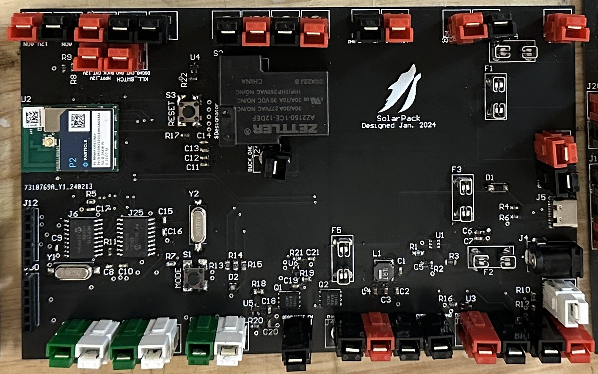
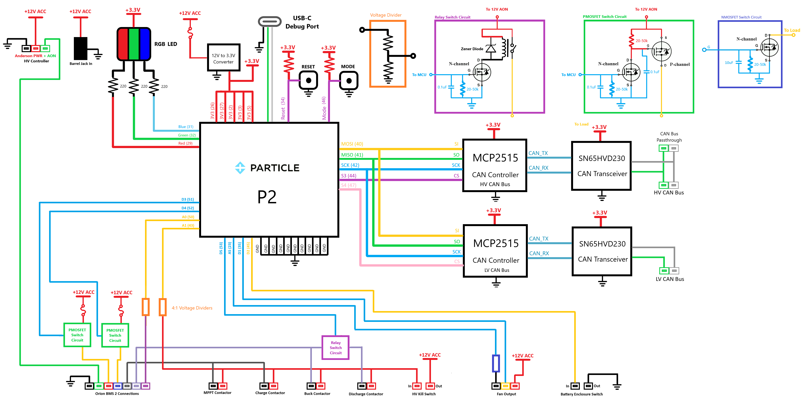
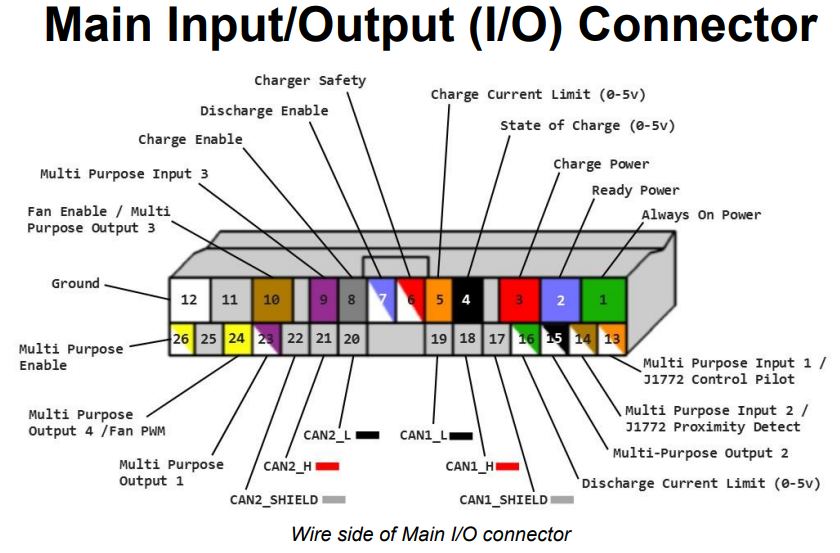
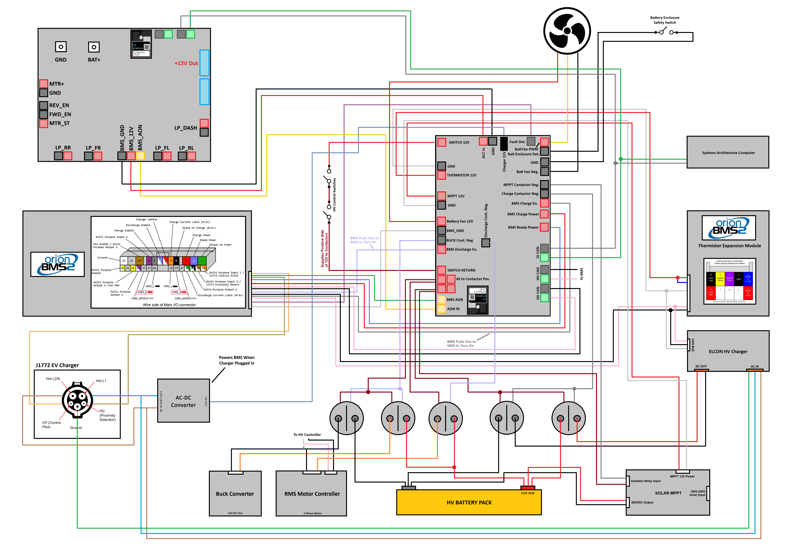
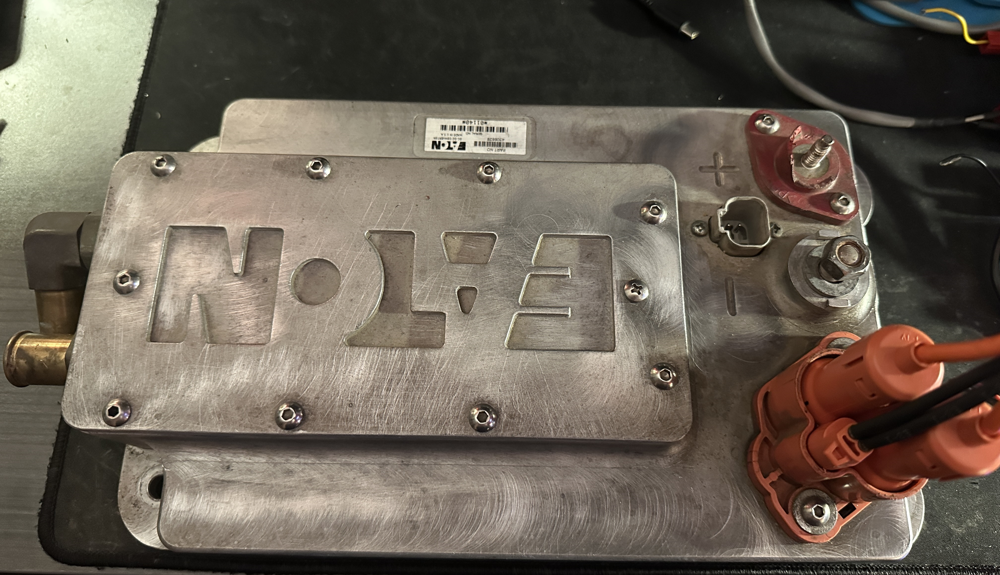
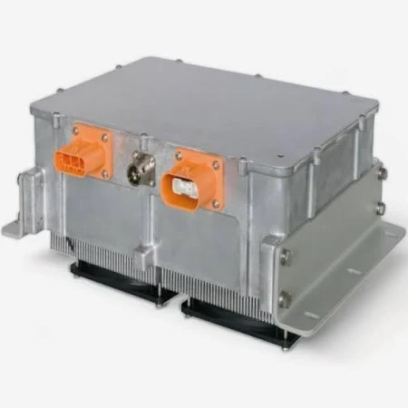
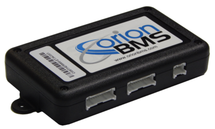
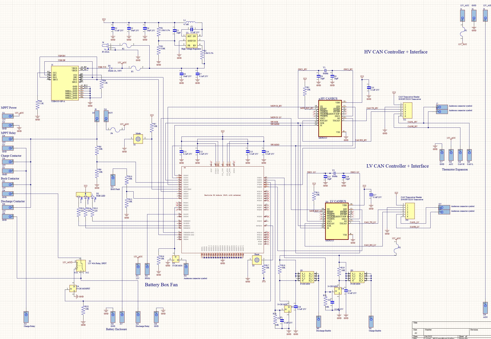
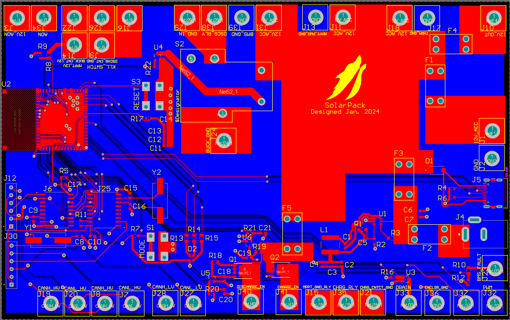

# DecentralizedLV-HVController
Software Repository for High Voltage Controller. Also contains information about the High Voltage System so the board's functions can be better understood.

## Project Overview

The DecentralizedLV High Voltage Controller has the primary role of interfacing between the High-Voltage and Low-Voltage system, including controlling the [Orion Battery Management System](https://www.orionbms.com/products/orion-bms-standard/) (Orion BMS 2). The Orion monitors all of the cells in the high voltage pack and enables/disables charging based on the cell states. The HV Controller is connected to both the High Voltage System CAN Bus and the Low Voltage System (Decentralized) CAN Bus. See the main [DecentralizedLV-Documentation](https://github.com/matthewpanizza/DecentralizedLV-Documentation) repository for information about the DecentralizedLV system and how to set up the software environment for programming this board.

## Block Diagram

## Hardware Capabilities
- 2X Non-PWM [Low-power driver pins](https://github.com/matthewpanizza/DecentralizedLV-Documentation?tab=readme-ov-file#low-power-output-pins-supply-power-to-low-power-devices-less-than-5-amps) (D3, D4) (P-MOSFET Configuration)
- 2X [Sense Pins](#https://github.com/matthewpanizza/DecentralizedLV-Documentation?tab=readme-ov-file#sense-pins-read-binary-onoff-switches-or-12v-signals) (4:1 voltage divider ratio)
- Dual MCP2515 CAN Bus Controllers
- Anderson header breakout for [Orion BMS 2](#orion-bms-2-wiring)
- Anderson headers for the driver's HV kill-switch
- Anderson header for Battery Box Fan
- Power header for [Thermistor Expansion Module](#thermistor-expansion-module)
- Relay for disabling [Discharge Contactor](#orion-bms-2-wiring) for the [Buck Converter](#buck-converter)
- Barrel jack for powering the board from the [J1772 EV Charger](#j1772-ev-charging)

## Important Roles
- Controls the [Orion BMS 2](#orion-bms-2-wiring) charge and discharge states
- Reads the fault state of the [Orion BMS 2](#orion-bms-2-wiring) and relays that information to the Low-Voltge CAN Bus
- Acts as a wiring harness between the Orion 2 and the battery contactors
- [To-Do] Relays messages between the High-Voltage and Low-Voltage CAN Bus
- [To-Do] Allows for Buck-Converter-Only mode by disabling Discharge Contactor going to the motor controller

### CAN Bus Communication

CAN Bus communication is handled using the [DecentralizedLV-Boards API](https://github.com/matthewpanizza/DecentralizedLV-Boards) submodule for sending and receiving messages. The submodule also has the CAN message encoding and decoding for this board and other boards in the system. Check out the [DecentralizedLV-Documentation](https://github.com/matthewpanizza/DecentralizedLV-Documentation) repository for information about CAN Bus communication.

This board has dual CAN Buses, one of which connects to the 500kbps Low-Voltage CAN Bus and another which connects to the 250kbps High-Voltage CAN Bus. Make sure you set the Chip Select Pin correctly for each CAN Controller. Using these two CAN Buses, this board needs to pass the following information from the HV to the LV CAN Bus:

- Battery Temperature from the Orion 2
- Battery State of Charge (SoC) from the Orion 2
- Battery Voltage from the Orion 2
- Battery Current from the Orion 2
- Motor temperature from the motor controller
- Motor RPM from the motor controller
- Motor fault state from the motor controller

These parameters are needed by the [Dashboard Controller](https://github.com/matthewpanizza/DecentralizedLV-DashController) to display on the [Camry Instrument Cluster](https://github.com/matthewpanizza/CANAnalyzer#chapter-2-2018-camry-instrument-cluster) and by the new Systems Architecture computer for telemetry transmission.

### Orion BMS 2 Wiring

The Orion BMS 2 has a series of inputs and outputs to control which state it is and read back any errors. There are three power pins used to determine the state of the BMS: Charge Power, Ready Power, and Always-On power. All of these three pins take 12V.

When the BMS is first powered by either Charge or Ready Power, it reads all of the cells in the High Voltage pack and determines if they are in a health state. If the cells are healthy, and the Charge Power is at 12V, then the Orion will connect the Charge Enable signal to GND. If the cells are healthy, and the Discharge Power is at 12V, then the Orion will connect the Discharge Enable signal to GND. Generally, when the car is in the Accessory state, then the Charge Power is on to allow for the MPPT solar charge converter to charge the battery. When in ignition, both Charge and Ready Power are on to allow for solar charging and discharging of the pack when driving.

The Charge Enable and Discharge Enable outputs are attached to a set of contactors which have a control line powered by 12VDC. Contactors are very large relays and are used to isolate the main output of the battery pack. The contactors allow the Orion to disable the HV battery in the case of over/under-voltage, over-current or over-temperature events. However, those two signals are connected to the *negative* side of the 12V (i.e GND), and not positive 12V. This means that the positive side of the contactor has to be connected to the 12V battery positive. However, we also need a way for the driver to manually cut off the battery pack in case of an emergency, so there is actually a set of switches this 12V signal must go through first before going to the positive side of the 12V control line of the contactors. This acts like an "AND" gate, where the kill switches must be turned on, and the BMS must be happy.

### J1772 EV Charging

There are also a set of pins used to interface with the J1772 EV charger (pins 13 and 14 on the BMS connector). These get directly connected to two of the pins on the J1772 connector along with the AC wires that go to the [ELCON charger](#elcon-charger). In order to use the J1772, it needs what's known as a "Pilot" signal to tell the EV charger to turn on - this comes from the 12V Always-On signal, which is directly connected to the 12V low-voltage battery through the [Power Controller](). Once the AC charger is connected, it negotiates with the BMS and allows for AC power to flow in through the J1772 connector. We have an AC-DC brick that generates 12V off of the AC power coming in through J1772 which is used to power up the HV controller (connects through the black barrel jack near USB-C). This 12V signal should also be fed back to the [Power Controller]()'s AC Charge input signal to notify the car that the J1772 is connected. When J1772 is connected, the [Dashboard Controller](https://github.com/matthewpanizza/DecentralizedLV-DashController) and the [Low-Power-Driver Board](https://github.com/matthewpanizza/DecentralizedLV-LPDRV) that controls the BMS fault indicator needs to be woken up by the [Power Controller](). This is to allow for displaying of the white flashing indicator in the case that a BMS fault occurs while charging.

### Buck Converter

One of the main High-Voltage components is the buck converter. This piece of equipment is like the alternator in a traditional car - it takes the 400V from the HV pack and steps it down to 12V for charging the 12V accessory battery.

On the HV Control board, there is a separate ouput connector for a contactor that goes to the buck converter. This allows the HV Controller to disable the main output to the motor controller while maintaining the discharge output to power the buck converter. With some help from the Power Controller, you can power up just the HV Controller and BMS to allow for the 12V battery to charge. This would be a useful tool in the case that the 12V battery is low and you are just trying to get enough power to get the Orion to turn on without drain from other 12V components. To turn on the Discharge output to allow power to flow to the motor controller, set pin `D5` to be an `OUTPUT` with `pinMode()` on the P2 and set its state with `digitalWrite()` to `HIGH`.

### Elcon Charger

To charge the HV Battery from the wall via J1772, we have an off-the-shelf AC-DC charger from Elcon. This charger takes in a wide range of AC voltages and can output at a wide range of DC voltages as well. The charger is automatically controlled by the Orion Battery Management System over CAN Bus. The charger needs to be configured in the [Orion BMS 2 Software Utility](https://www.orionbms.com/products/orion-bms-standard#downloads) in one of the extension menus. Its CAN Bus is connected to the same CAN Bus used for the [Thermistor Expansion Module](#thermistor-expansion-module).

**Important Note**: This charger communicates over CAN at 250kbps, not the 500kbps commonly used in the LV CAN Bus.

### Thermistor Expansion Module

The Orion BMS 2 has a set of eight integrated thermistors on its harness for measuring the temperature of the battery cells. However, since our pack is very large, we need additional thermistors to ensure no set of cells is getting too hot. To do this, we use this thermistor expansion module from Orion which connects to the BMS over CAN Bus (the same CAN Bus as the [Elcon Charger](#elcon-charger)).

This thermistor module has a 10-pin connector which carries the CAN bus and its required 12V power. The HV Controller has a spare pair of Anderson connectors for supplying power to the thermistor expansion module.

### Battery Fan Control

The HV Control board has a set of headers for controlling a standard 3-pin style PC fan that can be placed on the battery enclosure for cooling. This fan can either be a 12V-direct fan (two-pin) or a PWM fan (3-pin). There is a MOSFET on the negative side of the fan connector which can be driven with PWM to adjust the fan speed. If you read in the temperature of the highest cell from the Orion 2 over the CAN Bus, you can throttle down the fan speed based on the cell temperature. If you're not reading the temperature, set it to full speed.

### Battery Enclosure Detection

There is also a set of two Anderson connectors which can be connected to a limit switch. This limit switch can be placed on the battery box and set to be open when the battery enclosure is opened. With this signal, you could disable the Charge or Ready power when the box is opened. To use this feature, set pin `D2` to be an `INPUT_PULLUP` with `pinMode()`, and then do a `digitalRead()` on it's value. A value of `false` indicates the switch is closed, and `true` when the switch is open.

### PCB Schematic / Boardview

